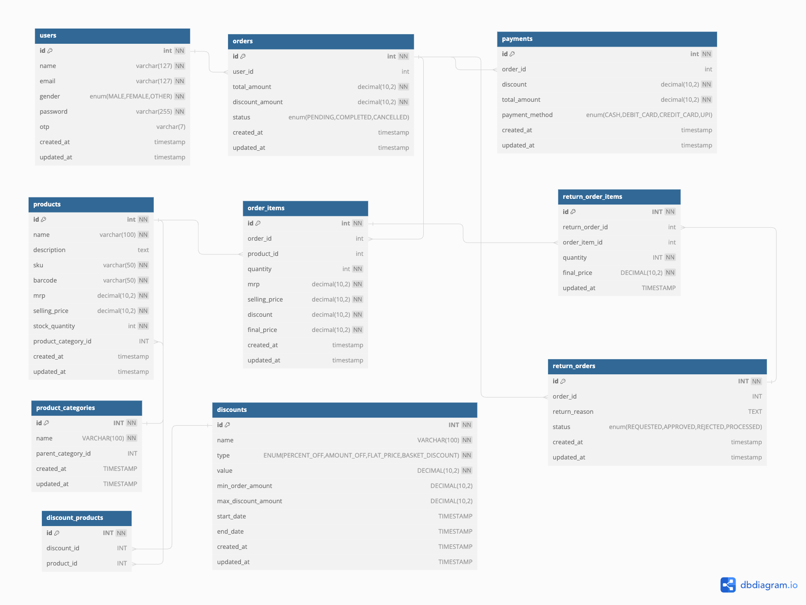

# mysql ecommerce db schema 



For info visit [dbdocs.io](https://dbdocs.io/mentorx.india/ecommerce_v1)


#  Mysql
###  Linux 
- Installation
``` bash
sudo apt install mysql-server
sudo mysql_secure_installation
```
- Start Mysql
 ``` bash
sudo systemctl start mysql
```

- Connect to Mysql
 ``` bash
sudo mysql -u root -p
```

### Windows

Download xampp https://www.apachefriends.org/download.html

Open xampp, start mysql > shell 
- Setup password
``` bash
mysqladmin -u root password123
```
- Connect to Mysql
 ``` bash
mysql -u root -p
```

#  SQL (Structured Query Language) Basics 

```sql
-- show all databases
show databases

-- create database
create database shilpa_ecommerce_db;

-- use or open database
use shilpa_ecommerce_db;

-- show all tables in database
show tables

```
Create Table SQL queries are found  [here](ecommerce_mysql_schema.sql)

``` sql
-- delete the table
drop table users;

-- delete the database
drop database shilpa_ecommerce_db
```

# SQL CRUD (Create, Read, Update, Delete) 

 - ## Create (Insert) a New User:

```sql
INSERT INTO users (name, email, gender, password, otp, created_at, updated_at)
VALUES ('Shilpa Dora', 'shilpadora19@gmail.com', 'Female', 'password123', NULL, CURRENT_TIMESTAMP, CURRENT_TIMESTAMP);
```

- ## Read (Select) Users:
 1. #### Select all users:

``` sql
SELECT * FROM users;
```
2. #### Select users by specific conditions (e.g., by email):

```sql
SELECT * FROM users WHERE email = 'shilpadora19@gmail.com';
```

3. #### Additional Queries
``` sql
-- Select users with distinct genders
SELECT DISTINCT gender FROM users;

-- Select users with mobile longer than 9 characters:
SELECT * FROM users WHERE LENGTH(mobile) > 9;

-- Select all users ordered by their name in ascending order
SELECT * FROM users ORDER BY name ASC;

-- Select all users ordered by their name in descending order
SELECT * FROM users ORDER BY name DESC;

-- Select 2 users:
SELECT * FROM users LIMIT 2;

-- Select 2 new users
SELECT * FROM users ORDER BY created_at DESC LIMIT 2;` 

-- Select 2 old or first 2 users:
SELECT * FROM users ORDER BY created_at ASC LIMIT 2;`

-- Select the oldest male user:
SELECT * FROM users WHERE gender = 'M' ORDER BY created_at ASC LIMIT 1;

-- Select the newest female user:
SELECT * FROM users WHERE gender = 'F' ORDER BY created_at DESC LIMIT 1;

-- Select the user with the earliest registration date
SELECT * FROM users WHERE created_at = (SELECT MIN(created_at) FROM users);

-- Select the user with the latest registration date
SELECT * FROM users WHERE created_at = (SELECT MAX(created_at) FROM users);

-- Select all users whose names start with 'Shilpa' and are Female(F)
SELECT * FROM users WHERE name LIKE 'Shilpa%' AND gender = 'F';

-- Select users with names starting with 'a' or 'b'
SELECT * FROM users WHERE name LIKE 'a%' OR name LIKE 'b%';` 

-- Select users with names containing 'dora'
SELECT * FROM users WHERE name LIKE '%dora%';

-- Select users with names ending with 'a'
SELECT * FROM users WHERE name LIKE '%a';

-- Select users ordered by name and mobile
SELECT * FROM users ORDER BY name ASC, mobile ASC;

-- Count the number of female users
SELECT COUNT(*) AS female_users_count FROM users WHERE gender = 'F';

-- Select all users and group them by gender
SELECT gender, COUNT(*) AS user_count FROM users GROUP BY gender;

-- Select users grouped by gender ordered by user count in descending order
SELECT gender, COUNT(*) AS user_count FROM users GROUP BY gender ORDER BY user_count DESC;

-- Select users with distinct email domains ordered by email domain:
SELECT DISTINCT SUBSTRING_INDEX(email, '@', -1) AS email_domain FROM users ORDER BY email_domain;

-- Select the number of users registered each year:
SELECT YEAR(created_at) AS registration_year, COUNT(*) AS user_count FROM users GROUP BY registration_year;

-- Select users grouped by year, month of registration:
SELECT YEAR(created_at) AS registration_year, MONTH(created_at) AS registration_month, COUNT(*) AS user_count FROM users GROUP BY registration_year, registration_month;

-- Select the number of users registered each day
SELECT DATE(created_at) AS registration_date, COUNT(*) AS user_count FROM users GROUP BY registration_date;

```

- ## Update User Information:

``` sql
UPDATE users
SET name = 'Mandili Shilpa Dora', updated_at = CURRENT_TIMESTAMP
WHERE email = 'shilpadora19@gmail.com';
```

- ## Delete User:
```sql
DELETE FROM users WHERE email = 'shilpadora19@gmail.com';
```

### Alter table SQL

``` sql
-- Add a new column `addres` with data type VARCHAR(63):
ALTER TABLE users ADD COLUMN addres VARCHAR(63);

-- Rename the column `addres` to `address`
ALTER TABLE users RENAME COLUMN addres TO address;`

-- Change the data type of the column `address` to VARCHAR(255):
ALTER TABLE users MODIFY COLUMN address VARCHAR(255);`

-- Drop the column `address`
ALTER TABLE users DROP COLUMN address;
```


